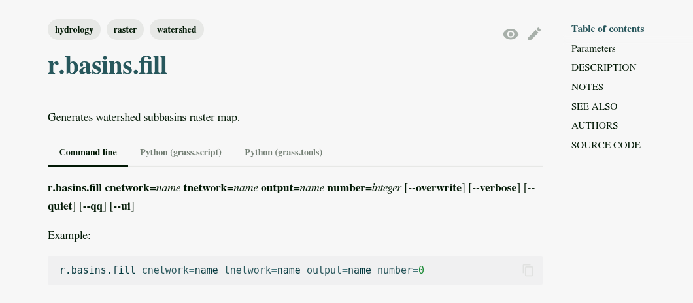

[grass_parser]: https://grass.osgeo.org/grass85/manuals/parser_standard_options.html
[grass_keywords]: https://grass.osgeo.org/grass-devel/manuals/keywords.html
[grass_testing_framework]: https://grass.osgeo.org/grass85/manuals/libpython/gunittest_testing.html#
[pytest]: https://docs.pytest.org/en/stable/index.html

# Addon structure

**_Corey White and Caitlin Haedrich_**

Example code structure for a Python-based addon:

```text
r.myaddon
├── Makefile
├── r.myaddon.html
├── r.myaddon.ipynb (optional)
├── r.myaddon.py
└── tests
    └── test_r_myaddon.py

```

Let's take a closer look at the contents of the `Makefile` and `r.myaddon.py`.

## Makefile

A Makefile is required to build and install the addon within the GRASS environment.
Here is a simple example of a Makefile for an addon named `r.myaddon`:

```makefile
MODULE_TOPDIR = ../..

PGM=r.myaddon

include $(MODULE_TOPDIR)/include/Make/Script.make

default: script
```

**MOULE_TOPDIR**
  points to the root directory of the GRASS source code, which is necessary for
  building the addon.

**PGM**
  specifies the name of the addon module.
  
**include**
  directive includes the standard Makefile rules for building GRASS scripts.

**default**
target specifies that the default action is to build the script.

## r.myaddon.py

At the beginning of a GRASS addon script is a standard **header** describing
the module followed by a section with **standardized description, keywords, options**
and **flags**. This second section is automatically parsed into the documentation.

### Header Template

A standard header template for a GRASS addon contains metadata about the module,
its authors, purpose, and licensing information.

```python
#!/usr/bin/env python

##############################################################################
# MODULE:    r.myaddon
#
# AUTHOR(S): Corey White <email or work affiliation>
#            Caitlin Haedrich <email or work affiliation>
#
# PURPOSE:   Demo how to create a GRASS addon at FOSS4GNA 2025
#
# COPYRIGHT: (C) 2025 by Corey White and the GRASS Development Team
#
#            This program is free software under the GNU General Public
#            License (>=v2). Read the file COPYING that comes with GRASS
#            for details.
##############################################################################
```

### Standardized options and flags

After the header, we define the module's description, keywords, options and flags.
GRASS provides a standardized way to define these using the
[standard Parser Options][grass_parser] standard option structure.

#### Tool Metadata

We define the module's metadata with a description and keywords using
special comments that are parsed by GRASS when the module is run. For example:

```python
# %module
# %description: This is a demo GRASS addon module.
# %keyword: demo
# %keyword: addon
# %end
```

> Note: The `%module` and `%end` tags are required to define the module
metadata.

**Keywords**
  help users find the module when searching in GRASS, and the
  description provides a brief overview of what the module does.

- the **first** keyword is the tool family which goes to the
  [tool family index](https://grass.osgeo.org/grass-devel/manuals/general.html)
  in the manual and should correspond to the first part of the tool name
  (e.g., r is for raster).
- the **second** keyword is the overall topic which goes to the
  [topic index](https://grass.osgeo.org/grass-devel/manuals/topics.html) in the
  manual
- the **third** (and more) keyword goes to the
  [keyword index](https://grass.osgeo.org/grass-devel/manuals/keywords.html) in
  the manual

Look at existing Keywords in the
[keyword list documentation][grass_keywords]
when deciding on keywords for your addon.

#### Options and Flags

In python, we define options and flags using special comments that are parsed
by GRASS when the module is run. For example, to define an input raster option, we
can use the following syntax:

```python
# %option G_OPT_R_INPUT
# %end
# %option
# % key input2
# % description Raster #2
# % type string
# %end
```



[_The keywords are rendered as `tags` in the documentation._](https://grass.osgeo.org/grass85/manuals/r.basins.fill.html)

The complete list of standard options and flags can be found in the
[GRASS Parser Options documentation][grass_parser].

### Main Functionality

```python
def main():
    # Your addon functionality goes here
    pass

if __name__ == "__main__":
    main()
```

### Toolboxes and shared utilities

If your addon includes multiple tools (toolbox) you can create a shared
utilities library (i.e., utilities.py), to hold common functions used
across multiple tools.

```text
r.myaddon/
├── utils
    ├── __init__.py
    ├── Makefile
    ├── utils.py
    └── testsuite
        └── test_utils.py
├── r.myaddon.a
    ├── Makefile
    ├── r.myaddon.html
    ├── r.myaddon.ipynb (optional)
    ├── r.myaddon.py
    └── tests
        └── test_r_myaddon.py
├── r.myaddon.b
    ├── Makefile
    ├── r.myaddon.html
    ├── r.myaddon.ipynb (optional)
    ├── r.myaddon.py
    └── testsuite
        └── test_r_myaddon.py

```

### Testing

GRASS addons should include tests to ensure their functionality works as expected.
Tests are typically located in a `testsuite` or `tests` directory within the
addon structure. Tests found in the `testsuite` directory use
[The GRASS Testing framework][grass_testing_framework], `gunittest`, while
tests found in the `tests` directory utilize [pytest][pytest].

## Next Steps

Proceed to [Developing an addon](./Developing_an_addon.md) to learn how to
create and contribute your own GRASS addon.
