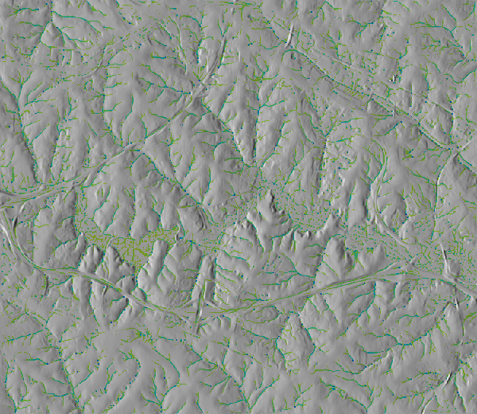

## DESCRIPTION

The purpose of  *r.simwe.scenario* is to run simulations of with variable rainfall [mm/hr].

## NOTES

This is a recommended section to explain the algorithm and parameter
behavior in a greater detail.

## EXAMPLE

```python
tools.r_simwe_scenario(elevation=r_simwe_scenario_input, output=r_simwe_scenario_output)
```

```python
tools.r_simwe_scenario(elevation=r_simwe_scenario_input, output=r_simwe_scenario_output, flags="d")
```

  
*Figure: SIMWE scenario with depth filtering.*

## REFERENCES

This section is optional. List related publications here.

## SEE ALSO

List related GRASS tools here.
*[https://grass.osgeo.org/grass-stable/manuals/g.region.html](r.sim.water.html)*


## AUTHORS

Corey T. White
